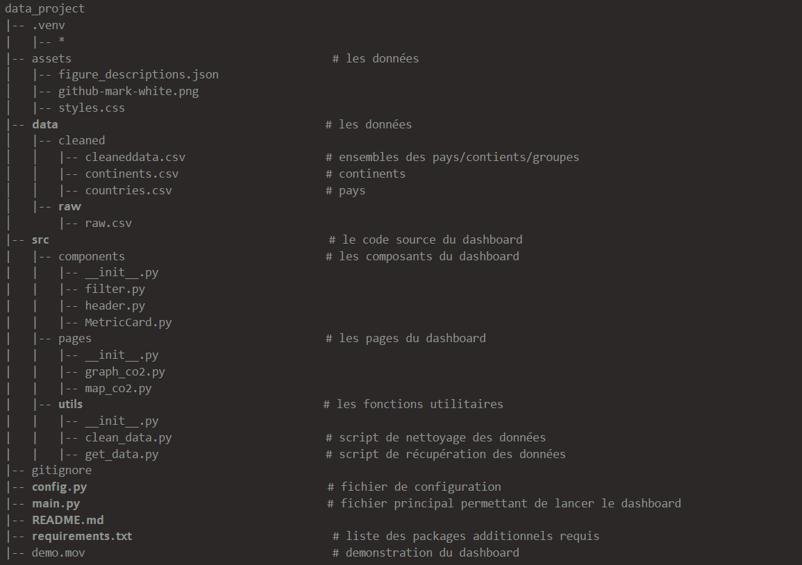

# data_projet
 Projet en python

## Auteurs
- [@Aissatou28](https://github.com/Aissatou28)
- [@assiamxn](https://github.com/assiamxn)

## Guide
1. Installez les dépendances avec la commande : 
`pip install -r requirements.txt`
2. Récupérez et lancez le dashboard avec : 
`python main.py`

## Data
Les [données utilisées](https://github.com/owid/co2-data?tab=readme-ov-file) sont fournis par [Our World In Data](https://ourworldindata.org/) et sont récupérée dynamiquement.
Le set de data provient de plusieurs sources que vous pouvez trouver directement dans le readme.  

## Developer guide
                             # demonstration du dashboard

## Rapport d'analyse
On peut voir dans les statisiques générales que les pays les plus émetteurs de co2 ne sont pas forcément ceux dont les habitants en produisent le plus. Et qu'il y a une légère baisse générale quant à l'émissions de co2 par personne au cours des dernières années.

## Copyritght
Nous déclarons sur honneur que le code fourni a été produit par nous même, à l’exception deux fichiers ci dessous:
* /src/components/MetricCard.py
* /src/components/header.py
Qui sont basé sur le code de [Jwolf](https://stream-metrics-b5f68d63e431.herokuapp.com/).
Ils ont été utilsée afin d'améliorer l'aspect visuel du code.

## Ressources
Hannah Ritchie, Pablo Rosado and Max Roser (2023) - “CO₂ and Greenhouse Gas Emissions” Published online at OurWorldinData.org.
Retrieved from: 'https://ourworldindata.org/co2-and-greenhouse-gas-emissions' [Online Resource]